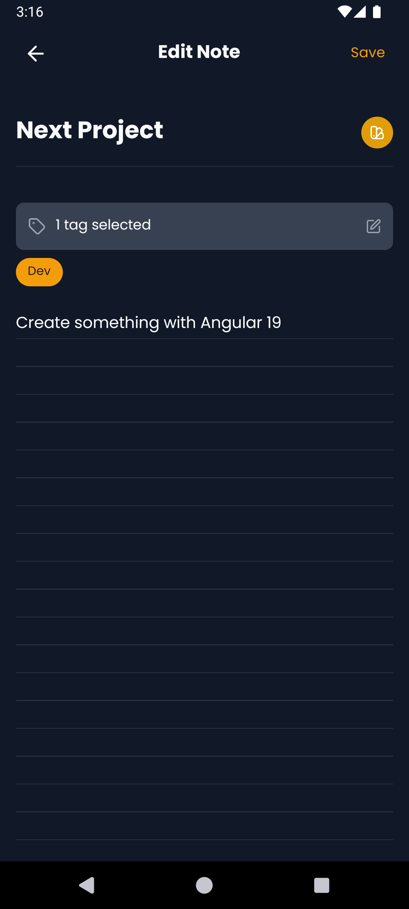

# PostIt - Sticky Notes App

A simple, intuitive, minimalistic sticky notes application built with React Native and Expo. Capture your thoughts, ideas, and reminders with ease.

## Features

-   **Create & Manage Notes:** Easily add, edit, and delete notes.
-   **Color Coding:** Assign different colors to your notes for better organization.
-   **Tagging System:** Organize notes using customizable tags.
-   **Archive System:** Archive notes to keep your workspace clean.
-   **Light & Dark Mode:** Adapts to your system's theme preference.
-   **Persistent Storage:** Notes and tags are saved locally using AsyncStorage.
-   **Intuitive UI:** Clean and user-friendly interface.

## Screenshots

<div style="display: grid; grid-template-columns: repeat(auto-fill, minmax(200px, 1fr)); gap: 10px; justify-content: space-evenly; align-items: center;">
    
    
    
    
</div>

## Getting Started

### Prerequisites

-   Node.js (LTS version recommended)
-   Expo Go app (for testing on physical devices) or Android/iOS emulator

### Installation

1.  Clone the repository:
    ```bash
    git clone https://github.com/ahm282/stickynotesapp/
    cd postit
    ```
2.  Install dependencies:
    ```bash
    npm install
    ```
3.  Start the development server:
    ```bash
    npm start
    ```

## Contributing

Contributions are welcome! If you have suggestions or improvements, please fork the repository and submit a pull request.

## License

This project is licensed under the GPL-2.0 License - see the [LICENSE](LICENSE) file for details.
